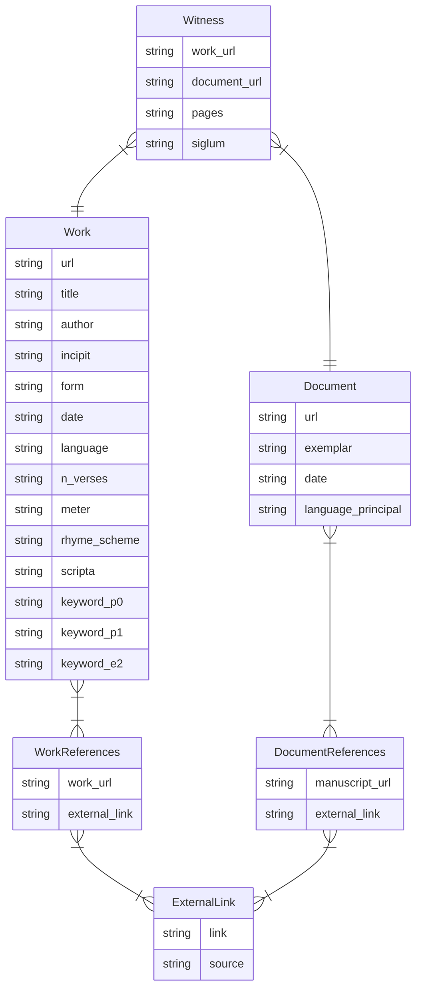

# Jonas Manuscript Scraper

Scrape information from Jonas's online database.

- [Get started](#install-program)
- [Scrape URLs](#run-program)
- [Export output](#export-output)

## Install Program

1. Clone this repository (aka download the software's files) : `git clone git@github.com:LostMa-ERC/JonasScraper.git`
2. Create and activate a virtual Python environment: version 3.12.
3. Install this tool : `pip install .`
4. Test the installation : `jonas --version`

## Run Program

Users can [scrape a single URL](#single-url), directly from the command line, or a [batch of URLs](#csv-batch) in a CSV.

Because webpages of works and manuscripts from Jonas contain links to multiple other entities, such as witnesses, it is recommended to save the SQL database that the program creates internally to a persistent file. This also allows you to do the following:

1. Stop and restart the data collection without redoing URLs the program already scraped and saved in the database.

2. Access all the information after scraping more than one URL.

### Single URL

To scrape a single URL from the command line, run the following command:

```console
jonas scrape -u URL
```

The screen will clear, and display the progress as well as the results.

```console
─────────────────────────────────────────────────────────────── Scraping Jonas ────────────────────────────────────────────────────────────────╮
│                                                                                                                                               │
│                                                 URL: 'http://jonas.irht.cnrs.fr/oeuvre/10453'                                                 │
│                                                                                                                                               │
╰───────────────────────────────────────────────────────────────────────────────────────────────────────────────────────────────────────────────╯
Witnesses: 0    |       Works: 0
        
Requesting URL  http://jonas.irht.cnrs.fr/oeuvre/10453
Witness(
    work_url='http://jonas.irht.cnrs.fr/oeuvre/10453',
    document_url='http://jonas.irht.cnrs.fr/manuscrit/72281',
    pages='Folio 62r - 64r',
    siglum=None
)
Work(
    url='http://jonas.irht.cnrs.fr/oeuvre/10453',
    title='Sermon joyeux de la vie saint Oignon',
    author=None,
    incipit='Ad deliberandum Patris / Sit Sanctorum Ongnonnaris',
    form='vers',
    date='15e-16e s.',
    language='oil-français',
    n_verses='126',
    meter='Octosyllabes',
    rhyme_scheme='rimes plates',
    scripta=None,
    keyword_p0='Personnages',
    keyword_p1='Personnages',
    keyword_e2='Brigitte de Suède'
)
Scraping ━━━━━━━━━━━━━━━━━━━━━━━━━━━━━━━━━━━━━━━━ 1/1 0:00:07 0:00:00

```

### CSV Batch

When scraping a batch of URLs, the in-file needs to be a CSV with a column containing the URL of a manuscript or work record in Jonas's online database. The column can contain both. The program will sort them accordingly.

|jonas_url|
|--|
|http://jonas.irht.cnrs.fr/manuscrit/72924|
|http://jonas.irht.cnrs.fr/oeuvre/10453|
|http://jonas.irht.cnrs.fr/manuscrit/60326|

Run the following command:

```console
jonas scrape -i CSV -c COLUMN -d DATABASE
```

The screen will clear, and display the progress, but not the results. It is recommended to save the results to a database file using the option `-d`.

```console
╭─────────────────────────────────────────────────────────────── Scraping Jonas ────────────────────────────────────────────────────────────────╮
│                                                                                                                                               │
│                                                          0 Finished | 245 Unfinished                                                          │
│                                                                                                                                               │
╰───────────────────────────────────────────────────────────────────────────────────────────────────────────────────────────────────────────────╯
┌────────────────────────────┬───────┐
│          subject           │ total │
│          varchar           │ int64 │
├────────────────────────────┼───────┤
│ Littérature didactique     │     2 │
│ Arts, technique et métiers │     1 │
│ Littérature narrative      │     1 │
│ Littérature religieuse     │     1 │
│ Littérature scientifique   │     1 │
│ Personnages                │     1 │
└────────────────────────────┴───────┘

Witnesses: 501  | Works: 243    | Manuscripts: 2
        
Scraping ━━━━━━━━━━━━━━━━━━━━━━━━━━━━━━━━━━━━━━━━ 245/245 0:01:44 0:00:00

```

The header on the display shows the number of finished and unfinished URLs. This is calculated at the start of the program and compares the URLs given as input and those already in the database. In the case of a completely new database, as seen in the example above, there will be 0 finished.

### Program Output

While scraping, the program generates and stores the related information in a DuckDB SQL database. It links the data in the following way:



One `Document` record can have multiple witnesses (`Witness` records) in it. And one `Document` record can be associated to multiple `ExternalLink` records. To handle this cardinality, the relational table `DocumentReferences` is used.


## Export Output

Because the information is linked, you can export it from either the perspective of a work or a document (manuscript). Both subcommands (`dump works`, `dump manuscripts`) produce a JSON file.

```console
jonas dump works -f DATABASE -o OUTFILE
```

The output for the dump of works looks like the following:

```json
{
    "works": {
        "http://jonas.irht.cnrs.fr/oeuvre/13419": {
            "metadata": {
                "url": "http://jonas.irht.cnrs.fr/oeuvre/13419",
                "title": "Ordonnance de l'office d'armes",
                "author": null,
                "incipit": "Il est vray selon les usaiges des philozophes que tous hommes doibvent naturellement desirer d'aprendre et de sçavoir",
                "form": "prose",
                "date": "15e s.",
                "language": "oil-français",
                "n_verses": null,
                "meter": null,
                "rhyme_scheme": null,
                "scripta": null,
                "keyword_p0": "Arts, technique et métiers",
                "keyword_p1": "Arts, technique et métiers",
                "keyword_e2": "Traités d'héraldique"
            },
            "witnesses": [
                {
                    "work_url": "http://jonas.irht.cnrs.fr/oeuvre/13419",
                    "document_url": "http://jonas.irht.cnrs.fr/manuscrit/81690",
                    "pages": "Folio 1r - 9r",
                    "siglum": null
                },
                {
                    "work_url": "http://jonas.irht.cnrs.fr/oeuvre/13419",
                    "document_url": "http://jonas.irht.cnrs.fr/manuscrit/81691",
                    "pages": "Folio 3r - 12r",
                    "siglum": null
                },
                {
                    "work_url": "http://jonas.irht.cnrs.fr/oeuvre/13419",
                    "document_url": "http://jonas.irht.cnrs.fr/manuscrit/17605",
                    "pages": "Folio 8r - 8v",
                    "siglum": null
                },
            ],
            "external_links": []
        }
    }
}
```

The output for the dump of manuscripts looks like the following:

```console
jonas dump manuscripts -f DATABASE -o OUTFILE
```

```json
{
    "manuscripts": {
            "http://jonas.irht.cnrs.fr/manuscrit/60326": {
                "metadata": {
                    "url": "http://jonas.irht.cnrs.fr/manuscrit/60326",
                    "exemplar": "TOURS, Bibliothèque municipale, 0952",
                    "date": null,
                    "language_principal": null
                },
                "witnesses": [
                    {
                        "work_url": "http://jonas.irht.cnrs.fr/oeuvre/4100",
                        "document_url": "http://jonas.irht.cnrs.fr/manuscrit/60326",
                        "pages": "Folio 0 - 0",
                        "siglum": null
                    }
                ],
                "external_links": [
                    {
                        "link": "https://arca.irht.cnrs.fr/ark:/63955/md988g84pp5r",
                        "source": "Arca"
                    },
                    {
                        "link": "https://bibale.irht.cnrs.fr/53680",
                        "source": "Bibale"
                    }
                ]
            },
    }
}
```