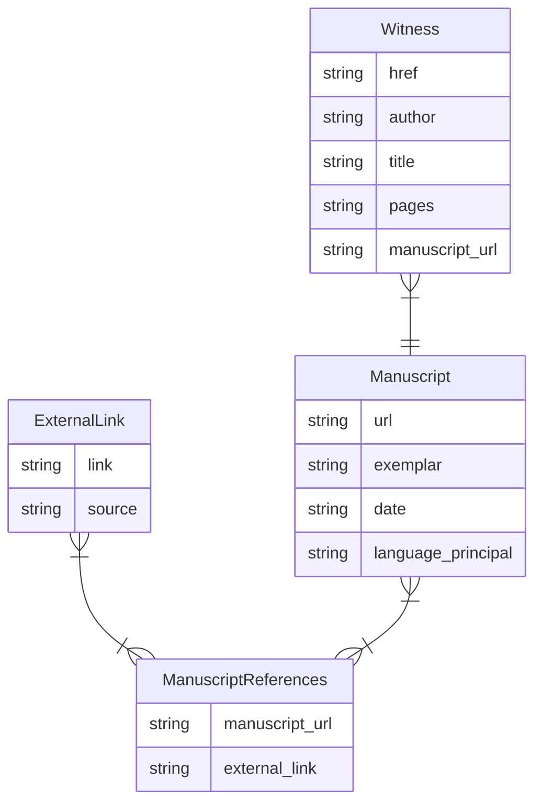

# Jonas Manuscript Scraper

Scrape information in Jonas's database.

## Install Program

1. Clone the repository (aka download the software's files) : `git clone git@github.com:LostMa-ERC/JonasScraper.git`
2. Create and activate a virtual Python environment: version 3.12.
3. Install the tool : `pip install .`
4. Test the installation : `jonas --version`

## Run Program

```shell
$ jonas scrape manuscripts -i INFILE -c COLUMN -f DB_FILE
```

- `-i` `--infile` : a path to the CSV file

- `-c` `--column-name` : the name of the column in the CSV file that contains the Jonas URLs 

- `-f` `--database` : a path to a local DuckDB file, which contains or will contain the program's output (i.e. `./corpus.db`)

By progressively storing the scraped data in a database (local DuckDB file), the scraping can be stopped and restarted without redoing URLs already entered in the database. How? Before scraping a page, the program checks to see if that Jonas URL is already stored in the `Manuscript` table. If your database file already has that manuscript record (and presumably its linked data, though we don't check for that because verification would require scraping), the program moves on to the next URL.

The ability to resume the processing without redoing URLs can also be useful when you add information to your in-file CSV, i.e. add more Jonas URLs to your dataset. To continue scraping your dataset, run the program with the same file. What has already been processed in your evolving dataset will be skipped.

If you want to update data already in your database file (i.e. you believe Jonas has updated their information), use the flag `--redo`.

If you want to erase everything in your database and start from scratch, use the flag `--restart`. This will drop all the tables in your DuckDB file.

## Input

The in-file needs to be a CSV with a column containing the URL of a manuscript record in Jonas's online database. Before running the program, clean / prepare the URLs so they begin with the following string: `http://jonas.irht.cnrs.fr/manuscrit/`. It is Jonas's standard practice to format the URLs of their manuscript records with the aforementioned prefix, followed by an integer identifier, i.e. `http://jonas.irht.cnrs.fr/manuscrit/72924`.

|jonas_url|
|--|
|http://jonas.irht.cnrs.fr/manuscrit/72924|
|http://jonas.irht.cnrs.fr/manuscrit/60326|


## Output

The scraping program finishes with a report printed in the console.

```console
             Scraping Results              
┏━━━━━━━━━━━━━━━━━━━━━━━━━━━━━━━━━━━━┳━━━━━┓
┃ Unique values in 'clean_jonas_url' ┃ 524 ┃
┡━━━━━━━━━━━━━━━━━━━━━━━━━━━━━━━━━━━━╇━━━━━┩
│              Jonas URLs (scraped)  │ 246 │
│          Jonas URLs (found in DB)  │ 278 │
│          Other URLs (not scraped)  │   0 │
└────────────────────────────────────┴─────┘
  Database Contents  
┏━━━━━━━━━━━━┳━━━━━━┓
┃      Table ┃ Rows ┃
┡━━━━━━━━━━━━╇━━━━━━┩
│ Manuscript │  524 │
│    Witness │ 1444 │
└────────────┴──────┘
DuckDB database file: results/corpus.db

```

### Export Option 1

If you prefer looking at all the data all at once, in a human-readable way, you can write the database's results to a JSON file.

```shell
$ jonas dump manuscripts -f DB_FILE -o OUTFILE
```

```json
{
    "manuscripts": {
        "http://jonas.irht.cnrs.fr/manuscrit/54777": {
            "metadata": {
                "url": "http://jonas.irht.cnrs.fr/manuscrit/54777",
                "exemplar": "SAINT-ETIENNE, Bibliothèque municipale, MS ANC E286",
                "date": "fin 13e-début 14e s.",
                "language_principal": "oil-français"
            },
            "witnesses": [
                {
                    "href": "https://jonas.irht.cnrs.fr/consulter/oeuvre/detail_oeuvre.php?oeuvre=5136",
                    "author": "Anonyme",
                    "title": "Sept sages de Rome, version A",
                    "pages": "Folio 1r - 15r"
                },
                {
                    "href": "https://jonas.irht.cnrs.fr/consulter/oeuvre/detail_oeuvre.php?oeuvre=5135",
                    "author": "Anonyme",
                    "title": "Marques de Rome",
                    "pages": "Folio 15r - 56r"
                }
            ],
            "external_links": [
                {
                    "link": "https://mediatheques.saint-etienne.fr/Default/digital-viewer/c-1982076",
                    "source": "Saint-Etienne-BM"
                },
                {
                    "link": "https://arca.irht.cnrs.fr/ark:/63955/md33rv043r7x",
                    "source": "Arca"
                }
            ]
        },
    }
}
```

### Export Option 2

If you like working in SQL, you can download what's necessary to connect to the local DuckDB file that the program created. It links the data in the following way:



One `Manuscript` record can have multiple witnesses (`Witness` records) in it. And one `Manuscript` record can be associated to multiple `ExternalLink` records. To handle this cardinality, the relational table `ManuscriptReferences` is used.
